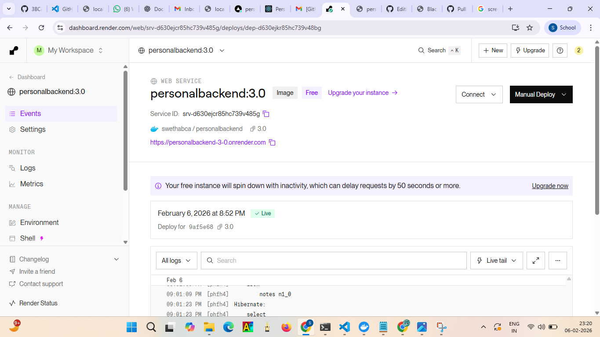

# Personal Note Backend

Spring Boot REST API for managing personal notes. This service provides a clean, structured backend foundation for note creation, retrieval, updates, and deletion, with a focus on maintainability, clear separation of concerns, and an approachable local developer experience.

## Executive Overview

### What this project is
This repository contains a Java 17+ Spring Boot backend that exposes a RESTful API for managing personal notes. The API is designed to be consumed by a frontend client or API tooling such as Postman for testing and evaluation.

### Why it is used
The service demonstrates a production-style backend architecture with a layered design (controller, service, repository) and a consistent persistence strategy using Spring Data JPA. It is suitable for enterprise evaluation, academic submissions, and portfolio review where clarity, correctness, and operational readiness are expected.

### How it works
Client requests are routed through a REST controller, processed by a service layer, and persisted via a repository backed by an H2 in-memory database. The application is configured using Spring Boot conventions and is started via Maven Wrapper commands for consistent developer workflows.

## System Architecture

### High-level flow
The request/response pipeline follows standard Spring Boot patterns to ensure testability and maintainability.

```
Client
  | HTTP
  v
Spring MVC Controller
  | Service Layer
  v
Spring Data JPA Repository
  | Persistence
  v
H2 In-Memory Database
```

### Key architectural decisions
- Layered architecture is used to separate concerns and enable clean testing boundaries.
- Spring Data JPA abstracts database access, reducing boilerplate and ensuring consistent data access patterns.
- H2 in-memory database enables fast local development and predictable runtime behavior for demos and evaluations.

## Backend Service

### What it is
A Spring Boot application that exposes REST endpoints for note management, providing CRUD operations through a consistent HTTP interface.

### Why it is used
The backend serves as the authoritative source of note data and enforces application-level logic, ensuring that clients remain thin and consistent.

### How it works
Spring MVC maps HTTP routes to controller methods, which delegate to a service layer for business logic. The service layer uses Spring Data JPA repositories to read and persist data.

## Frontend Integration

### What it is
A backend designed to be consumed by a separate frontend or API tooling. CORS settings explicitly allow approved frontend origins.

### Why it is used
Separating frontend and backend enables independent deployments, clearer responsibilities, and easier scaling in production environments.

### How it works
Allowed origins are configured in `application.properties`, permitting cross-origin requests from approved frontend domains.

## Tech Stack

### Core technologies
- Java 17+
- Spring Boot
- Spring Web
- Spring Data JPA
- H2 (in-memory)
- Maven Wrapper

### What each component provides
- Java 17+ provides a modern, stable runtime with long-term support features.
- Spring Boot simplifies configuration, auto-wiring, and application startup with standard conventions.
- Spring Web enables REST API development and request routing.
- Spring Data JPA provides repository abstractions and ORM capabilities.
- H2 supports lightweight local persistence without external dependencies.
- Maven Wrapper ensures consistent builds without requiring a global Maven installation.

## Prerequisites

### Required software
- Java 17+ installed

### Why it is required
The project is compiled and executed using Java 17+ features and Spring Boot compatibility expectations.

## Local Development

### What this section covers
It provides repeatable commands for running the backend locally and confirms the default runtime endpoint.

### How to run locally
The application can be started using the Maven Wrapper for your operating system.

- Windows (PowerShell)
  - `mvnw.cmd spring-boot:run`
- macOS/Linux
  - `./mvnw spring-boot:run`

### Runtime behavior
The API runs on http://localhost:8080 by default.

## API Reference

### What it is
A REST API for managing note resources using standard HTTP semantics.

### Why it is used
REST endpoints provide a clear, tool-friendly interface for integration testing, automation, and frontend consumption.

### How it works
A consistent base path (`/api/notes`) is used for all note operations. Each route maps to a distinct CRUD function in the controller layer.

### Base path
`/api/notes`

### Endpoints
- `GET /api/notes`
- `GET /api/notes/{id}`
- `POST /api/notes`
- `PUT /api/notes/{id}`
- `DELETE /api/notes/{id}`
- `DELETE /api/notes`

## Configuration

### CORS

#### What it is
Cross-Origin Resource Sharing (CORS) controls which frontend domains are permitted to access the API from a browser.

#### Why it is used
It provides a controlled integration point between the backend and external web frontends, ensuring secure access across domains.

#### How it is configured
Allowed origins are configured in `application.properties`:

- `app.cors.allowed-origins=https://personalfrontend.vercel.app`

To allow multiple origins, provide a comma-separated list:

- `app.cors.allowed-origins=https://personalfrontend.vercel.app,https://another.example.com`

### H2 Console

#### What it is
The H2 console provides a lightweight web UI for inspecting the in-memory database during development.

#### Why it is used
It enables rapid inspection of persisted data without requiring external database tools.

#### How to access it
Enabled at http://localhost:8080/h2-console

## Testing

### What it is
A Maven-driven test suite that validates application startup and wiring.

### Why it is used
Tests provide baseline confidence that the application context loads correctly and that core components are properly configured.

### How to run tests
- `mvnw.cmd test`
- `./mvnw test`

## DevOps and Deployment

### Docker image build

#### What it does
Builds a Docker image for the backend using the provided Dockerfile.

#### Why it is used
Containerization enables consistent runtime behavior across environments and facilitates deployment to container-based platforms.

#### How to run it
```
docker build -t personalnote-backend .
```

### Static analysis (Sonar)

#### What it does
Runs Sonar analysis for code quality and maintainability checks.

#### Why it is used
Static analysis provides early detection of code smells and potential defects, supporting enterprise-grade quality standards.

#### How to run it
```
mvnw.cmd sonar:sonar
```

### Pull request workflow

#### What it demonstrates
The repository includes a documented example of a proper pull request workflow.

#### Why it is used
It provides evidence of standard team-based Git practices suitable for enterprise environments.

#### How to run it
```
git push origin <branch-name>
```

## Evidence and Screenshots

### Backend evidence checklist (includes frontend verification)
1. Render dashboard → Service running
2. API URL opened in browser (`/api/notes`)
3. Docker container running (`docker ps`)
4. Postman or browser showing JSON response
5. Vercel deployed app homepage
6. Create new note screen
7. Notes list with data
8. Delete, update, search notes working
9. Browser console showing successful API call (200 OK)

### Development backend

Command:

```
mvnw.cmd spring-boot:run
```


**What it is**
- Evidence of the backend service running locally using the Maven Wrapper command.

**Why it is used**
- Confirms that the application boots successfully and is ready to accept HTTP requests during development.

**How it works**
- Spring Boot starts an embedded server, loads configuration, and initializes the application context.

### Docker image build

Command:

```
docker build -t personalnote-backend .
```


**What it is**
- Evidence of a successful container image build for the backend service.

**Why it is used**
- Demonstrates that the service can be packaged into a portable, reproducible runtime artifact.

**How it works**
- The Dockerfile is executed to create an image containing the application and its runtime dependencies.

### Rendering

Command:

```
mvnw.cmd spring-boot:run
```



**What it is**
- Evidence of the deployed service running in a hosted environment.

**Why it is used**
- Demonstrates operational readiness and successful runtime behavior beyond local development.

**How it works**
- The application is started in a deployment environment and exposed via the configured host platform.

### Sonar analysis

Command:

```
mvnw.cmd sonar:sonar
```

.png)

**What it is**
- Evidence of static code analysis results for the backend codebase.

**Why it is used**
- Provides measurable indicators of code quality, maintainability, and potential issues.

**How it works**
- The Sonar scanner evaluates source code and reports metrics and findings to the configured analysis server.

### Proper pull request (Backend)

Command:

```
git push origin <branch-name>
```

.png)

**What it is**
- Evidence of a compliant pull request workflow for backend changes.

**Why it is used**
- Establishes that changes are reviewed and integrated through a standard collaboration process.

**How it works**
- A feature branch is pushed to the remote repository to open or update a pull request.

## Additional Artifacts

### DevOps documentation
- [Deveops.pdf](screenshot/Deveops.pdf)

Added my Devops.pdf with it.

**What it is**
- A standalone DevOps document providing supporting evidence and documentation for the project.

**Why it is used**
- Offers additional context on operational practices, tooling, or processes that complement the backend implementation.

**How it works**
- The document is included as a separate artifact and is intended to be reviewed alongside this README.

## Backend Screenshot Checklist
1. Render dashboard → Service running
2. API URL opened in browser (`/api/notes`)
3. Docker container running (`docker ps`)
4. Postman or browser showing JSON response

